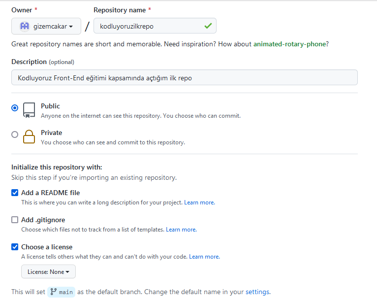

# Kodluyoruz İlk Repo
Bu repo [Kodluyoruz](https://www.kodluyoruz.org/) Front-End Eğitimi kapsamında açtığım ilk repo. İçerisinde bir adet README ve bir adet de index.html dosyası barındırıyor.



---


## Installation
___
Öncelikle projeyi clonelayın. (Buraya sizin reponuzdan aldığınız link gelecek.)

```bash
git clone https://github.com/gizemcakar/kodluyoruzilkrepo.git
```

## Usage
___
Projeyi cloneladıktan sonra Visual Studio Code programında açınız.

Linux için;
```linux
cd kodluyoruzilkrepo
code .
```
## Contributing
---
Pull requestler kabul edilir. Büyük değişiklikler için, lütfen önce neyi değiştirmek istediğinizi tartışmak için bir konu açınız.

## Licence
---
[MIT](https://choosealicense.com/licenses/mit/)
